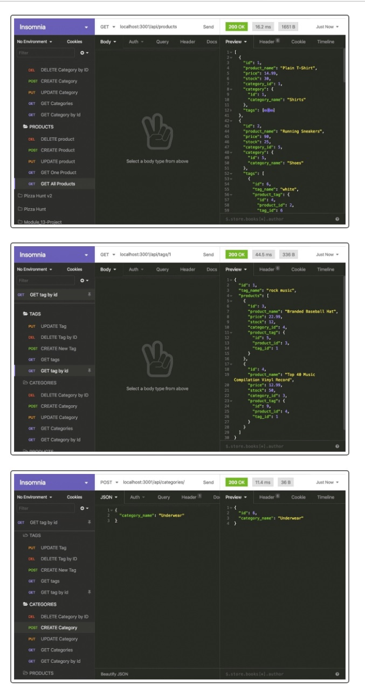

# Bootcamp Module 13 Challenge Assignment -- An "E-Commerce Server" Application

## Description

This current Module 13 Challenge assignment -- an "E-Commerce Server" -- is a console-based application that allows for online-store data that is contained in the MySQL2 database of the application to be managed/referenced/updated in an HTTP request/response message-transfer system -- by way of corresponding API URL route functions. The functional/usage details of the application are described at below. The assignment provided a good mechanism for further learning about the back-end setup requirements and considerations that are applicable to database-based application programming (Sequelize, data/table models, data types, requirements, validations, associations/joins/includes/relations); with much consideration about the various elements of CRUD-operation function/data flow to the database and then the related corresponding resultant data response processes that are necessary to send the database information to a hypothetical front-end application system.

This assignment did not include the creation of a front-end system; and instead the Insomnia HTTP request/response message-transfer API system was used to define and transmit to/from the necessary API URL routes that are necessary for the proper CRUD functionality of the application. Even though a front-end application creation was not necessary for this assignment project...there were many occurrences of side considerations and contemplations about its possible aspects and components.

----

The objectives -- user story and acceptance criteria items -- of the assignment were as follows:

[ User Story ]

AS A manager at an internet retail company

I WANT a back end for my e-commerce website that uses the latest technologies

SO THAT my company can compete with other e-commerce companies

[ Acceptance Criteria ]

GIVEN a functional Express.js API

WHEN I add my database name, MySQL username, and MySQL password to an environment variable file...
THEN I am able to connect to a database using Sequelize

WHEN I enter schema and seed commands...
THEN a development database is created and is seeded with test data

WHEN I enter the command to invoke the application...
THEN my server is started and the Sequelize models are synced to the MySQL database

WHEN I open API GET routes in Insomnia Core for categories, products, or tags...
THEN the data for each of these routes is displayed in a formatted JSON

WHEN I test API POST, PUT, and DELETE routes in Insomnia Core...
THEN I am able to successfully create, update, and delete data in my database

[ Additional Grading Criteria ]

Also good coding practices and good GitHub/Git repository configuration.

## Installation

Make sure that you have a GitHub membership and account to be able to view the repository of the assignment webpage system. The published GitHub Pages view of the website should be accessible on the public internet access URL without a need to have a GitHub membership/account.

** IMPORTANT **

If the repository is being cloned to a local user computer for separate review/grading/usage...then use the "npm i" command from the console of the local clone directory. That command will trigger the auto-install process for all of the imported 3rd-party module programs that are required for the "E-Commerce Server" application to be able to run. One of the module programs that is installed/required is the "MySQL2" database program...which is used to contain the data that the "E-Commerce Server" application uses. After the installation of the "MySQL2" database program...there is an additional requirement of the following manual installation steps that will require the database user name and authentication information items that are contained within the main application server file:

1) Load/Source the application database and its data table structures by entering the command "source schema.sql;" at a MySQL2 command prompt (when logged-in to that system) when the main file system location of the computer and the console window is in the clone database of the "E-Commerce Server" application. Exit/Quit the MySQL system.

2) Add an external ".env" database authentication information environment text file to the base level of the clone repository directory folder...and save into that file the following information lines...and replace the "user_ID" and "user_password" components with the appropriate user-specific information:

    DB_NAME='ecommerce_db'

    DB_USER='user_ID'

    DB_PASSWORD='user_password'

3) Load/Seed the example data of the application database by entering the command "npm seeds/index.js" at a Node/NPM command prompt (when logged-out of to the MySQL system) when the main file system location of the computer and the console window is in the clone database of the "E-Commerce Server" application; Alternatively the "npm start" command can be used to both seed the database and then start the server process.

## Usage

To use this application/webpage...at after when installing the application and its database and then using the "node server" command or the "npm start" command to start the application...

1. Open the Insomnia HTTP request/response message system.

2. Create/Enter CRUD routes as-desired for the various data models/tables of the application database (Category, Product, Product_Tag, Tag). The routes of the application are stored in the "./routes/api" directory folder of the application file-set.

3. View the existing records.

4. Update some existing records.

5. Create some new records.

The following picture shows the console-based appearance of the E-Commerce application:

### APPLICATION DEMONSTRATION VIDEOS

The following URL is for the GitHub Pages published static-view public view of Todd Kridel's Coding Bootcamp Module 13 Challenge assignment...which contains embedded display frames that are for the demonstration videos of the application; and the webpage also indicates a link that goes back to this README description file of the application: "https://todd-kridel.github.io/TK-E-Commerce-Server".

## Credits

Special mention to the contributor of the public bootcamp-related starter-code repository "fantastic-umbrella.git".

Contributor: @Xandromus -- Xandromus Xander Rapstine

## License

MIT License

Copyright (c) 2022 DU Full-Stack Web Development Coding Boot Camp

Permission is hereby granted, free of charge, to any person obtaining a copy
of this software and associated documentation files (the "Software"), to deal
in the Software without restriction, including without limitation the rights
to use, copy, modify, merge, publish, distribute, sublicense, and/or sell
copies of the Software, and to permit persons to whom the Software is
furnished to do so, subject to the following conditions:

The above copyright notice and this permission notice shall be included in all
copies or substantial portions of the Software.

THE SOFTWARE IS PROVIDED "AS IS", WITHOUT WARRANTY OF ANY KIND, EXPRESS OR
IMPLIED, INCLUDING BUT NOT LIMITED TO THE WARRANTIES OF MERCHANTABILITY,
FITNESS FOR A PARTICULAR PURPOSE AND NONINFRINGEMENT. IN NO EVENT SHALL THE
AUTHORS OR COPYRIGHT HOLDERS BE LIABLE FOR ANY CLAIM, DAMAGES OR OTHER
LIABILITY, WHETHER IN AN ACTION OF CONTRACT, TORT OR OTHERWISE, ARISING FROM,
OUT OF OR IN CONNECTION WITH THE SOFTWARE OR THE USE OR OTHER DEALINGS IN THE
SOFTWARE.

